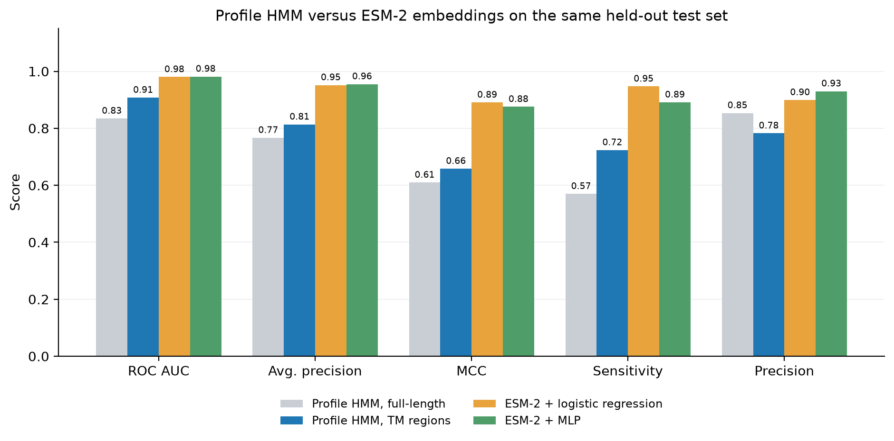
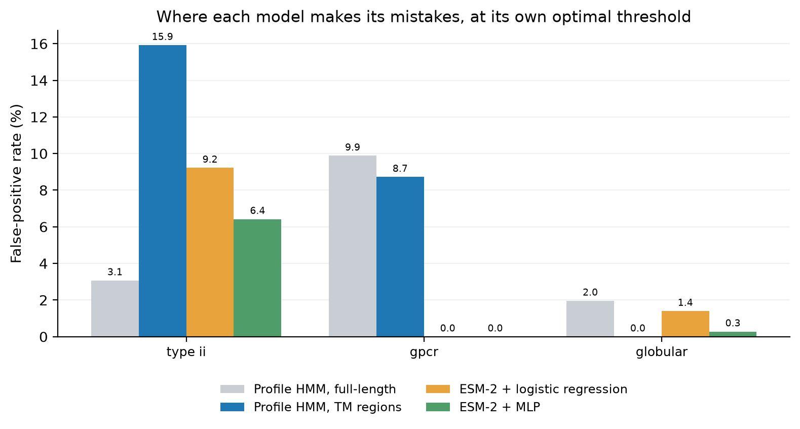
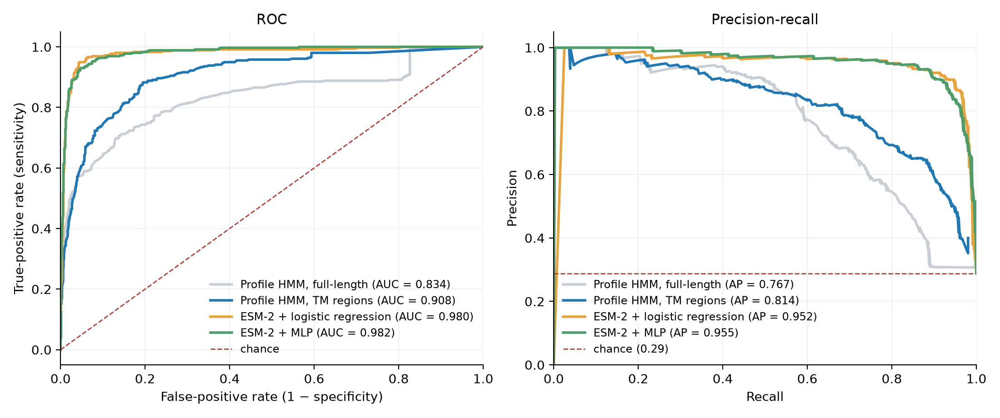

# Single-Pass Type I Transmembrane Protein Classification: Profile HMM vs Protein Language Model

[](https://github.com/aposfys/transmembrane-hmm-classifier/actions/workflows/ci.yml)
[](https://www.python.org/)
[](LICENSE)
[](https://docs.astral.sh/ruff/)

A head-to-head benchmark of two generations of sequence modelling on the same task: recognising **single-pass type I membrane proteins**, against decoys chosen to break the classifier. Classical profile HMMs (HMMER) are compared with **ESM-2 embeddings** plus a discriminative head, on an identical held-out test set.

The language model wins decisively — **ROC AUC 0.98 versus 0.91, MCC 0.89 versus 0.66**. But the more interesting result is that *both* families of model make their mistakes in the same place, and it is exactly where biology says they should.

| | |
| --- | --- |
| **Positives** | 1,789 reviewed single-pass type I proteins (UniProt, ≤ 40% pairwise identity) |
| **Decoys** | 358 single-pass **type II** · 172 **GPCRs** (polytopic) · 358 **globular** (no TM segment) |
| **Classical** | CD-HIT 40% → Clustal Omega → `hmmbuild` → `hmmsearch` → threshold sweep |
| **Modern** | ESM-2 650M mean-pooled embeddings (1280-d) → logistic regression / MLP |
| **Best model** | ESM-2 + MLP — **ROC AUC 0.982**, MCC 0.875, precision 0.930 |

<p align="center">
  
</p>

## Results

All four models are scored on **the same 358 positives and 888 decoys**, at each model's own MCC-optimal threshold.

| Model | ROC AUC | Avg. precision | MCC | Sensitivity | Specificity | Precision |
| --- | ---: | ---: | ---: | ---: | ---: | ---: |
| Profile HMM, full-length | 0.834 | 0.767 | 0.610 | 0.570 | 0.961 | 0.854 |
| Profile HMM, TM regions | 0.908 | 0.814 | 0.658 | 0.724 | 0.919 | 0.782 |
| ESM-2 + logistic regression | 0.980 | 0.952 | **0.891** | **0.947** | 0.957 | 0.899 |
| ESM-2 + MLP | **0.982** | **0.955** | 0.875 | 0.891 | **0.973** | **0.930** |

Three things are worth drawing out.

### 1. A linear probe on frozen embeddings is enough

Logistic regression on unmodified ESM-2 vectors reaches MCC 0.891; the MLP reaches 0.875. The non-linear head does not help, which means **the separation is already present in the representation** rather than being constructed by the classifier. ESM-2 was never trained on membrane topology — it learned it as a by-product of masked-language modelling over UniRef.

Trained on only 600 positives and 600 decoys, out-of-fold performance on the training pool (AUC 0.979) matches held-out test performance (AUC 0.980), so nothing is being memorised.

### 2. The errors are biologically structured, in every model

<p align="center">
  
</p>

| Decoy class | HMM (TM regions) | ESM-2 + logreg | ESM-2 + MLP | |
| --- | ---: | ---: | ---: | --- |
| Globular (no TM segment) | 0.0% | 1.4% | 0.3% | trivially separable |
| GPCR (polytopic) | 8.7% | **0.0%** | **0.0%** | solved by the language model |
| Single-pass **type II** | 15.9% | 9.2% | 6.4% | the irreducible case |

Type II proteins remain the hardest class for every model. They have the same single-helix architecture as type I and differ only in **which terminus faces the cytoplasm** — a distinction carried by the charge asymmetry of the flanking residues (the positive-inside rule), not by the helix itself. That the error ordering survives a change of model generation is evidence that it reflects the biology rather than a quirk of either method.

The language model eliminates GPCR confusion entirely, which the HMM never manages: distinguishing one membrane helix from seven requires context that a profile of the helix alone does not contain.

### 3. The default threshold is badly miscalibrated for the HMM

| Profile HMM, TM regions | Sensitivity | Specificity | Precision | MCC |
| --- | ---: | ---: | ---: | ---: |
| Conventional, E ≤ 0.05 | 0.425 | 0.981 | 0.899 | 0.536 |
| MCC-optimal, E ≤ 0.74 | **0.724** | 0.919 | 0.782 | **0.658** |

At the conventional cutoff the HMM misses **57% of true type I proteins**. E ≤ 0.05 is a convention inherited from homology search and is not an operating point for a topology classifier; the only way to find that out is to sweep every threshold.

<p align="center">
  
</p>

### Why the profile HMM is limited here

Single-pass type I proteins are **not a homologous family** — they are a topological class whose members share no common ancestor. A profile HMM models a family, so aligning whole sequences produces a meaningless alignment and a model that matches generic composition (AUC 0.834, errors spread evenly across all decoy classes including proteins with no membrane segment at all).

Restricting the model to the membrane segment plus 10 residues of flank helps, because that *is* a real motif: ~20 hydrophobic residues bounded by charge asymmetry. But it still models a single conserved pattern, whereas an embedding encodes the whole sequence context. That gap is what the 0.908 → 0.982 AUC improvement measures.

## A note on experimental design

The two model families are trained differently, and the asymmetry is deliberate:

- A profile HMM is **generative** — built from an alignment of positives only, it never sees a negative.
- A linear or MLP head is **discriminative** — it requires labelled negatives.

Head-training negatives are drawn strictly from the pool the shared test set did not consume, so no test sequence is ever trained on. An earlier version of this benchmark let the test set exhaust the GPCR pool, leaving the head with no GPCR training examples; it then scored **100% false positives on GPCRs**, which looked like a catastrophic failure but was purely an artefact of the split. Each decoy class is now capped at half its non-redundant pool so every class contributes to both sides. The lesson is in [`cli.py`](src/tmclass/cli.py) as a comment, because it is the kind of mistake that produces a plausible-looking number.

## Quick start

```bash
conda env create -f environment.yml   # HMMER, Clustal Omega, CD-HIT, Python deps
conda activate tmclass
pip install -e ".[dev]"

make data       # fetch and cluster all four classes (~40 min, cached afterwards)
make analysis   # HMMs, ESM-2 benchmark, cross-validation, figures
make test
```

```bash
make quick                                        # TM-region HMM only, no benchmark
python -m tmclass.cli --heads                     # HMMs only, skip the language model
python -m tmclass.cli --esm-model 35M             # smaller, faster embeddings
python -m tmclass.cli --esm-model 650M --device cpu
python -m tmclass.cli --padding 0                 # membrane segment with no flanks
```

**Runtime.** CD-HIT on the 6,343-sequence type I set is the slowest step (~40 min at 40% identity), cached afterwards. A full `make analysis` takes roughly 3 hours on an M4, dominated by ESM-2 650M embedding of ~2,400 sequences. `--esm-model 35M` cuts that to about 25 minutes with a modest accuracy cost. Embeddings are cached by model and sequence set, so re-running a head is instant.

**Optional dependencies.** The base install needs only Biopython and NumPy. `pip install -e ".[embeddings]"` adds torch, transformers and scikit-learn; the CLI imports them lazily, so the HMM path works without them.

## Method

1. **Fetch** four sequence classes from the UniProt REST API by subcellular-location and family term, with `ft_transmem` coordinates in the same response — no external topology-prediction service.
2. **Filter** positives to entries with exactly one annotated TM segment.
3. **Reduce redundancy** with CD-HIT at 40% identity, so no homologue spans the train/test boundary.
4. **Split** 80/20 with a fixed seed; cap each decoy class at half its pool.
5. **Classical path** — extract TM segments ± 10 residues, align with Clustal Omega, build with `hmmbuild`, score with `hmmsearch --max` (heuristic filters off, so weak hits still get an E-value and the ROC curve is not truncated).
6. **Modern path** — mean-pool ESM-2's final hidden layer over each sequence's residues, then fit a head. Sequences longer than 1,022 residues are split into overlapping windows and pooled across them, because truncating would discard the membrane segment of any C-terminally anchored protein.
7. **Evaluate** by sweeping every threshold that changes the confusion matrix, reporting ROC AUC, average precision and the full metric suite.

## Pitfalls this pipeline is built to avoid

Each of these silently produces numbers that look reasonable.

- **Sensitivity and specificity hide precision under class imbalance.** With 9 positives against 121 negatives, specificity 0.868 leaves 16 false positives — precision 0.30, meaning two of every three positive calls are wrong, from a pair of metrics that both look respectable. MCC and precision are primary here; a test pins that arithmetic.
- **A small test set cannot measure anything.** With 9 positives, one sequence moves sensitivity by 11 points. This uses 358 positives and 888 decoys, plus cross-validation with reported standard deviations.
- **E ≤ 0.05 is a convention, not an operating point.** Adopting it costs more than half the achievable sensitivity here.
- **CD-HIT truncates sequence names.** `cd-hit` defaults to `-d 20`, so `sp|Q8WXI7|MUC16_HUMAN` becomes `sp|Q8WXI7|MUC16_HUM` in the `.clstr` file. Any downstream `if identifier in records` filter keyed on full headers then drops most of the dataset without raising — in a 676-sequence clustering, **569 representatives (84%) vanish**. Here `-d 0` preserves headers, `subset_fasta` raises on an unmatched identifier, and `Split` validates that the partitions sum to their input.
- **Sequences missing from `hmmsearch` output are negatives, not missing data.** Dropping them shrinks the denominator and inflates every metric.
- **Padding dominates transformer batches.** Mixing a 40-residue window with a 1,022-residue one wastes most of the forward pass; length-sorted batching is worth more than half the embedding runtime.
- **A decoy class absent from training measures generalisation, not accuracy** — see the design note above.

## Repository layout

```
src/tmclass/
  data.py       UniProt queries, TSV parsing, TM-coordinate extraction
  regions.py    TM region slicing with flanks; TOPCONS parser
  pipeline.py   CD-HIT, splitting, Clustal Omega, hmmbuild, hmmsearch, tblout parsing
  plm.py        ESM-2 embedding with windowing, length-bucketed batching, caching
  heads.py      Logistic-regression and MLP heads; embedding separability
  benchmark.py  Trains the heads and scores them on the shared test set
  evaluate.py   Confusion matrix, metric suite, threshold sweep, ROC/PR areas
  plots.py      Curves, confusion matrices, model and error-class comparisons
  cli.py        Staged pipeline with cross-validation
tests/          pytest suite (29 tests)
results/        Models, sweeps, figures, findings.json
```

## Output files

| File | Contents |
| --- | --- |
| `results/tm_region.hmm` | The profile HMM, usable directly with `hmmsearch` |
| `results/*_sweep.csv` | Every threshold with its full metric row |
| `results/findings.json` | All four models, per-class errors, cross-validation |
| `results/model_comparison.png` | The headline figure |
| `results/error_by_decoy_class.png` | Where each model fails |
| `data/embeddings/*.npz` | Cached ESM-2 embeddings, keyed by model and sequence set |

## References

1. Lin, Z. *et al.* (2023). Evolutionary-scale prediction of atomic-level protein structure with a language model. *Science* **379**, 1123–1130. (ESM-2)
2. Rives, A. *et al.* (2021). Biological structure and function emerge from scaling unsupervised learning to 250 million protein sequences. *PNAS* **118**, e2016239118.
3. Eddy, S. R. (2011). Accelerated profile HMM searches. *PLoS Computational Biology* **7**, e1002195.
4. Eddy, S. R. (1998). Profile hidden Markov models. *Bioinformatics* **14**, 755–763.
5. von Heijne, G. (1992). Membrane protein structure prediction: hydrophobicity analysis and the positive-inside rule. *Journal of Molecular Biology* **225**, 487–494.
6. Fu, L., Niu, B., Zhu, Z., Wu, S. & Li, W. (2012). CD-HIT: accelerated for clustering the next-generation sequencing data. *Bioinformatics* **28**, 3150–3152.
7. Sievers, F. *et al.* (2011). Fast, scalable generation of high-quality protein multiple sequence alignments using Clustal Omega. *Molecular Systems Biology* **7**, 539.
8. Chicco, D. & Jurman, G. (2020). The advantages of the Matthews correlation coefficient (MCC) over F1 score and accuracy in binary classification evaluation. *BMC Genomics* **21**, 6.
9. UniProt Consortium (2023). UniProt: the universal protein knowledgebase in 2023. *Nucleic Acids Research* **51**, D523–D531.

## Author

**Apostolos Fysekidis** — MSc Bioinformatics & Computational Biology, National and Kapodistrian University of Athens.

Licensed under the [MIT License](LICENSE).
