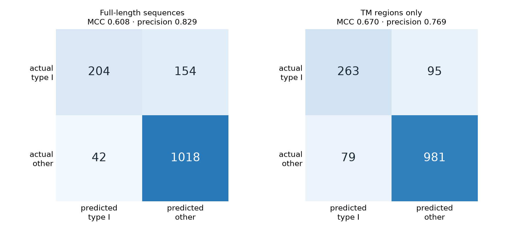

# Profile-HMM Classification of Single-Pass Type I Transmembrane Proteins

A HMMER pipeline that learns to recognise **single-pass type I membrane proteins** from sequence alone, and a rigorous evaluation of how well it actually works — against decoys chosen to break it.

The interesting result is not the headline accuracy. It is *where the model fails*: its errors concentrate almost entirely on type II proteins, which share the single-transmembrane-helix architecture and differ only in membrane orientation. Globular proteins are separated perfectly. The classifier learned membrane topology, exactly as intended, and its residual confusion is the biologically meaningful kind.

| | |
| --- | --- |
| **Positives** | 1,789 reviewed single-pass type I proteins (UniProt, ≤ 40% pairwise identity) |
| **Decoys** | 358 single-pass **type II** · 344 **GPCRs** (polytopic) · 358 **globular** (no TM segment) |
| **Method** | UniProt REST → CD-HIT 40% → Clustal Omega → `hmmbuild` → `hmmsearch` → threshold sweep |
| **Best model** | TM regions ± 10 residues of flank — **ROC AUC 0.919**, MCC 0.670, precision 0.769 |

<p align="center">
  
</p>

## Three findings

### 1. Restricting the model to the membrane segment is what makes it work

Both models are built from **the same 150 training proteins** and differ only in representation: whole protein versus the transmembrane segment plus 10 residues of flank on each side. That controlled comparison is decisive:

| | Full-length | TM regions | |
| --- | ---: | ---: | --- |
| ROC AUC | 0.833 | **0.919** | |
| Average precision | 0.746 | **0.816** | |
| Sensitivity | 0.570 | **0.735** | at each model's MCC-optimal cutoff |
| Specificity | 0.960 | 0.925 | |
| Precision | 0.829 | 0.769 | |
| MCC | 0.608 | **0.670** | |

The reason is structural. Single-pass type I proteins are **not a homologous family** — they are a topological class whose members share no common ancestor. A profile HMM models a *family*, so aligning their whole sequences produces a meaningless alignment and the resulting model matches generic sequence composition. The membrane segment, by contrast, is a genuine physicochemical motif: ~20 hydrophobic residues bounded by the charge asymmetry of the positive-inside rule. That is something a profile HMM can represent.

### 2. The default significance threshold is badly miscalibrated for this task

| Cutoff | Sensitivity | Specificity | Precision | MCC |
| --- | ---: | ---: | ---: | ---: |
| Conventional, E ≤ 0.05 | 0.425 | 0.984 | 0.899 | 0.548 |
| MCC-optimal, E ≤ 0.92 | **0.735** | 0.925 | 0.769 | **0.670** |

At the conventional cutoff the model misses **57% of true type I proteins**. Sweeping the threshold and choosing by Matthews correlation nearly doubles sensitivity for a 6-point specificity cost, raising MCC from 0.548 to 0.670. E ≤ 0.05 is a convention inherited from homology search; it is not the right operating point for a topology classifier, and the only way to find out is to sweep.

### 3. The errors land where biology says they should

<p align="center">
  
</p>

False positives at each model's optimal threshold, broken down by decoy class:

| Decoy class | Full-length | TM regions | |
| --- | ---: | ---: | --- |
| Globular (no TM segment) | 1.7% | **0.0%** | trivially separable |
| GPCR (polytopic) | 7.3% | 6.4% | |
| Single-pass **type II** | 3.1% | **15.9%** | the genuinely hard case |

The TM-region model makes **zero** errors on globular proteins — 0 of 358. Its confusion is concentrated on type II proteins, which have the same single-helix architecture and differ only in which terminus faces the cytoplasm. That is the discrimination that requires the flanking-charge signal, and it is where a sequence-only model should struggle.

The full-length model spreads its errors evenly across all three classes, including proteins with no membrane segment at all. Its errors have no topological structure, which is another way of seeing that it never learned topology.

### Cross-validation confirms the estimate is stable

Five-fold cross-validation of the TM-region model, at E ≤ 0.05:

| | Mean | SD |
| --- | ---: | ---: |
| Sensitivity | 0.580 | 0.115 |
| Specificity | 0.991 | 0.004 |
| MCC | **0.605** | 0.046 |

Fold-to-fold MCC varies by less than 0.05, so the reported performance is a property of the method rather than of one lucky split.

## Quick start

```bash
conda env create -f environment.yml   # HMMER, Clustal Omega, CD-HIT, Python deps
conda activate tmclass
pip install -e ".[dev]"

make data       # fetch and cluster all four classes (slow, ~40 min, cached afterwards)
make analysis   # both models, cross-validation, figures
make test
```

```bash
make quick                                     # TM-region model only, no cross-validation
python -m tmclass.cli --padding 0              # membrane segment with no flanks
python -m tmclass.cli --identity 0.3           # stricter redundancy reduction
python -m tmclass.cli --max-train 400          # larger training set (slower alignment)
```

**Runtime.** CD-HIT on the 6,343-sequence type I set is the slowest step (~40 min at 40% identity) but its output is cached, so it runs once. After that, `make analysis` takes roughly 45 min, dominated by the full-length alignment and by `hmmsearch --max`. `make quick` takes about 10 min.

## Method

1. **Fetch** four sequence classes from the UniProt REST API by subcellular-location and family term, with `ft_transmem` coordinates included in the same response.
2. **Filter** the positive set to entries with exactly one annotated TM segment — some entries carry a single-pass location term but two annotated segments, and those contradict the class definition.
3. **Reduce redundancy** with CD-HIT at 40% identity, so no homologue spans the train/test boundary.
4. **Split** 80/20 with a fixed seed. Both models train on the same capped subset of the training partition, so the comparison isolates representation.
5. **Extract** each TM segment with 10 residues of flank on either side. The flanks carry the positive-inside charge asymmetry that distinguishes type I from type II.
6. **Align** with Clustal Omega, **build** with `hmmbuild`, **score** with `hmmsearch --max` (heuristic filters off, so weak hits still receive an E-value and the ROC curve is not truncated).
7. **Evaluate** by sweeping every threshold that changes the confusion matrix, reporting ROC AUC, average precision, and the full metric suite at both the conventional and the MCC-optimal cutoff.

Sequences absent from `hmmsearch` output scored below the reporting threshold and are counted as negative predictions, not dropped — otherwise the denominator silently shrinks and every metric is inflated.

## Refinements over the original coursework version

Reworked from an MSc assignment ([original Greek report](docs/original-report-gr.pdf), [original scripts](docs/original-scripts/)). The original reported sensitivity 1.00 / specificity 0.48 for a full-length model and 0.778 / 0.868 for a TM-region model. Six changes:

- **Precision is now reported.** The original quoted only sensitivity and specificity. On its own test set — 9 positives against 121 negatives — specificity 0.868 means 16 false positives, so precision was **0.30**: roughly two of every three positive calls were wrong. Sensitivity and specificity conceal this entirely under class imbalance, which is why MCC and precision are now primary. A test asserts these exact numbers.
- **A test set large enough to measure anything.** The original evaluated on 9 positive sequences, where one sequence moves sensitivity by 11 points. This version uses 358 positives and 1,060 decoys, plus 5-fold cross-validation with reported standard deviations.
- **Threshold sweeping instead of a fixed E ≤ 0.05.** ROC and PR curves across every distinct score, with the operating point chosen by MCC. This is what revealed that the conventional cutoff costs more than half the achievable sensitivity.
- **A silent data-loss bug fixed.** The original split script read cluster representatives out of the CD-HIT `.clstr` file, then kept only those that matched a record in the FASTA (`[records[id] for id in train_ids if id in records]`). CD-HIT truncates names to 20 characters by default, so `sp|Q8WXI7|MUC16_HUMAN` was recorded as `sp|Q8WXI7|MUC16_HUM` and never matched. Re-running that logic against the original's own files: **569 of 676 representatives — 84% — were discarded without warning**, leaving the 107 that happened to have short-enough names, which is exactly where the original's 98 training and 9 test sequences came from. `cd-hit -d 0` now preserves full headers, `subset_fasta` raises on an unmatched identifier instead of skipping it, and `Split` validates that the two partitions sum to their input.
- **No external web service.** The original depended on a 15 MB TOPCONS submission that took 81 minutes of server time and could not be regenerated without re-submitting. TM coordinates now come from UniProt's own annotation in the same request as the sequences. The TOPCONS parser is retained in [`regions.py`](src/tmclass/regions.py) so the original workflow still runs.
- **A controlled comparison.** The original's two models were trained on differently derived sets, so the difference between them confounded representation with data. Both models here are built from the same proteins.

Note that the original's headline sensitivity of 1.00 alongside specificity 0.48 is the signature of a model that calls almost everything positive. That is consistent with what this version finds: a profile HMM over full-length sequences of a non-homologous topological class does not learn topology.

## Repository layout

```
src/tmclass/
  data.py       UniProt queries, TSV parsing, TM-coordinate extraction
  regions.py    TM region slicing with flanks; TOPCONS parser
  pipeline.py   CD-HIT, splitting, Clustal Omega, hmmbuild, hmmsearch, tblout parsing
  evaluate.py   Confusion matrix, metric suite, threshold sweep, ROC/PR areas
  plots.py      Curves and confusion matrices
  cli.py        Staged pipeline with cross-validation
tests/          pytest suite (29 tests)
results/        Models, sweeps, figures, findings.json
docs/           Original coursework report and scripts
```

## Output files

| File | Contents |
| --- | --- |
| `results/tm_region.hmm` | The profile HMM, usable directly with `hmmsearch` |
| `results/*_sweep.csv` | Every threshold with its full metric row |
| `results/*_positive.tbl`, `*_negative.tbl` | Raw `hmmsearch` output |
| `results/findings.json` | Both models, per-class errors, cross-validation |
| `results/roc_pr_curves.png`, `confusion_matrices.png` | Figures |

## References

1. Eddy, S. R. (1998). Profile hidden Markov models. *Bioinformatics* **14**, 755–763.
2. Eddy, S. R. (2011). Accelerated profile HMM searches. *PLoS Computational Biology* **7**, e1002195.
3. Durbin, R., Eddy, S. R., Krogh, A. & Mitchison, G. (1998). *Biological Sequence Analysis*. Cambridge University Press.
4. von Heijne, G. (1992). Membrane protein structure prediction: hydrophobicity analysis and the positive-inside rule. *Journal of Molecular Biology* **225**, 487–494.
5. Fu, L., Niu, B., Zhu, Z., Wu, S. & Li, W. (2012). CD-HIT: accelerated for clustering the next-generation sequencing data. *Bioinformatics* **28**, 3150–3152.
6. Sievers, F. *et al.* (2011). Fast, scalable generation of high-quality protein multiple sequence alignments using Clustal Omega. *Molecular Systems Biology* **7**, 539.
7. Chicco, D. & Jurman, G. (2020). The advantages of the Matthews correlation coefficient (MCC) over F1 score and accuracy in binary classification evaluation. *BMC Genomics* **21**, 6.
8. UniProt Consortium (2023). UniProt: the universal protein knowledgebase in 2023. *Nucleic Acids Research* **51**, D523–D531.

## Author

**Apostolos Fysekidis** — MSc Bioinformatics & Computational Biology, National and Kapodistrian University of Athens.

Licensed under the [MIT License](LICENSE).
